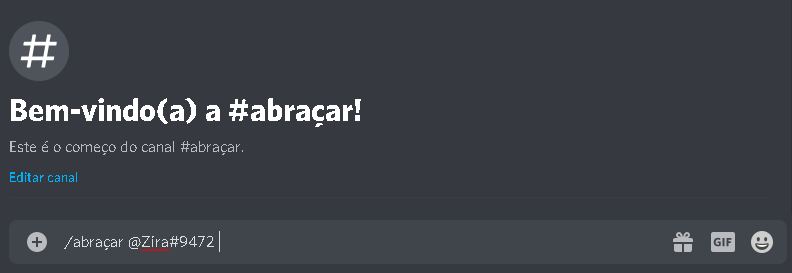

# Comandos

## 🔧 Comandos pra Donos de Servidores

O Kimetsu possui uma serie de comandos para auxiliar os donos de servidores a moderar o servidor. Vamos conferir alguns dos comandos suas permissões necessárias e como utilizar.


Somente os donos de servidores podem usar esses comandos abaixo

O Kimetsu necessita de certas permissões para executar alguns desses comandos, tenha em mente que ele seja Administrador do Servidor ou possua as permissões de Banir Membros, Gerenciar Mensagens, Gerenciar Cargos.


## 🔧 Moderação

* /ban &lt;@usuário&gt;  - Bane um usuário. 
* /kick &lt;@usuário&gt;  - Expulsa um usuário. 
*  /mute `<@usuário>` `<tempo> <30s/1h/1d` - Muta um usuário. 
* /unmute `<@usuário>` - Desmuta um usuário.
* /warn &lt;@usuário&gt;  - Adiciona um warn no usuário. 
* /warns &lt;@usuário&gt; - Veja todos os warns de um usuário. 
* /limpar  - Limpa uma certa quantia de mensagens. \(2 a 99\). 
* /anuncio   - Envia um anuncio embed para o canal. 
* /votação   - Abre uma votação em um canal. 
* /say - Envia uma mensagem com o bot.

## ⚙️ Configuração

*  /prefix `<prefix>` - Altera o prefix do bot no servidor. 
* /comandocustom - Adiciona um comando customizado ao bot. 
* /modolento `<segundos>` - Ativa o modo lento no canal.
*  /giveaway `<tempo - canal - premio>` - Faça Doação de premios.
*  /bemvindos `<#canal>` - Ativa mensagem de boas-vindas em um canal.
* /saida `<#canal>` - Ativa mensagem de saida em um canal.
* /autorole `<@Cargo>` - Da um cargo automatico quando membro entra no servidor. 
* /bemvindosoff - Desativa mensagem de bem-vindos
*  /saidaoff - Desativa mensagem de saida
*  /autoroleoff `<@cargo>` - Desativa cargo automático no qual você definiu.

## 😂 Comandos para Membros do servidor

O Kimetsu possui uma serie de comandos para os membros dos servidores, comandos de diversão. Vamos conferir alguns dos comandos suas permissões necessárias e como utilizar.


Esses comandos podem ser utilizados por todos os membros do servidor. 

O Kimetsu necessita de certas permissões para executar alguns desses comandos, tenha em mente que ele seja Administrador do Servidor ou possua as permissões de enviar mensagens no servidor.


*  /pergunta `<mensagem>` - Responde suas perguntas. 
* /tapa `<@usuário>` - Da um tapa em um usuário. 
* /abraçar `<@usuário>` - Da um abraço em um usuário. 
* /beijar `<@usuário>` - Da um beijo em um usuário. 
* /divorciar `<@usuário>` - Divorcia de um usuário. 
* /casar `<@usuário>` - Casa com um usuário.
*  /soco `<@usuário>` - Da um soco em um usuário. 
* /tapinha `<@usuário>` - Da um tapinha em um usuário. 
* /cosquinha `<@usuário>` - Faz cocegas em um usuário 
* /love `<@usuário>` - Mostra a % que vocês se amam. 
* /biscoito `<@usuário>` - Da um biscoito para um usuário.
* /alpaca - Mostra uma imagem fofinha de alpaca.
*  /lhama - Mostra uma imagem fofinha de lhama.
*  /fox - Mostra uma imagem fofinha de raposas. 
* /bird - Mostra uma imagem fofinha de passaros. 
* /dog - Mostra uma imagem fofinha de cachorro. 
* /baka - Gera imagem de baka. 
* /smug - Gera imagem smug. 
* /kemonomimi - Gera imagem de uma kemonomimi. 
* /waifu - Gera a imagem da sua/seu waifu. 
* /advinha - Acerte o número em 10 tentativas.
*  /primeiraspalavras `<mensagem>` - Cria o meme das primeiras palavras.
* /conquista `<titulo>` - Cria uma conquista Minecraft com seu titulo.
* /laranjo `<mensagem>` - Cria um meme do laranjo. 
* /trivia - Inicia um jogo de advinhação. 
* /8ball - Faça perguntas ao bot.

## ⭐ Comandos Úteis

* /ajuda - Exibe o menu de ajuda. 
* /serverinfo - Mostra status do servidor. 
* /userinfo - Mostra o perfil do usuário. 
* /botinfo - Mostra informações sobre o bot. 
* /ping - Mostra o delay bot-servidor. 
* /avatar - Mostra o seu atavar ou mencione alguem para ver o avatar.

## 💵 Comandos de Economia

* /darpontos  &lt;usuário- Adiciona Kimes para um usuário
*  /tirarpontos  - Remove Kimes da conta do usuário 
* /apostar &lt;quantidade- Aposta uma quantidade de Kimes
*  /comprar - &lt;carro / nikes / broze / mansão - Faz compras na loja de Kimes /daily - Recebe uma quantidade aleatória de Kimes a cada 24h 
* /depositar  - Deposita uma quantidade de Kimes no banco 
* /sacar  - Saca uma quantidade de Kimes do banco 
* /emprego - Se junta a um emprego para ganhar Kimes 
* /trabalhar - Trabalha e ganha uma quantidade aleatória de Kimes a cada 5h /pagar &lt;quantidade - Transfere uma quantidade de Kimes para outro membro 
* /perfil - Veja o seu perfil completo ou de outros membros basta /perfil @usuário
*  /reputação  - Da um ponto de reputação ao usuário mencionado 1 vez a cada 24h 
* /roleta  - Aposta Kimes na roleta 
* /roletacor   - Aposta Kimes na roleta \| Vermelho, preto ou verde 
* /roubar &lt;@usuário&gt; - Rouba uma quantidade de Kimes do usuário - VIPS ROUBAM MAIS 
* /saldo - Veja a quantidade de Kimes que você tem na carteira 
* /saldobanco - Veja a quantidade de Kimes que você tem no banco

## 🚀 Exemplo

* Última atualização: 20 de julho de 2020

